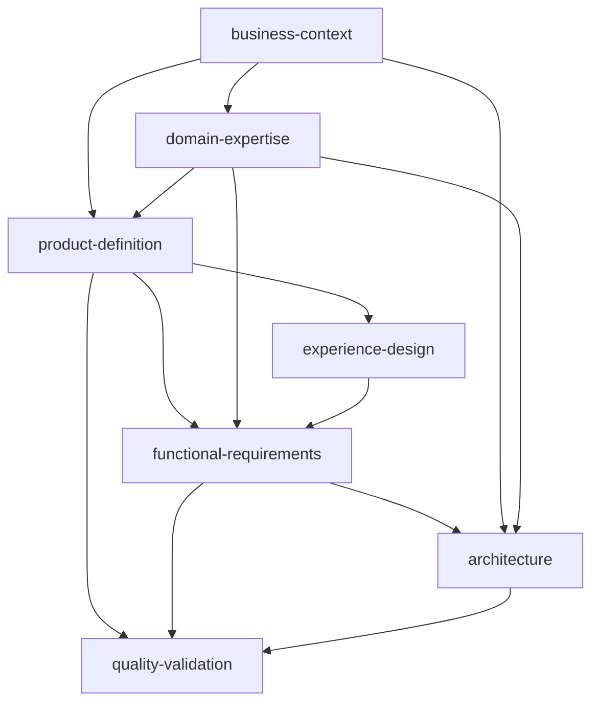

# 📚 Project Documentation

This project uses the **CLARITY Framework** for comprehensive product development documentation. This README will guide you through the documentation structure and help you find the information you need.

---

## 🗂️ **Documentation Structure**

The project documentation is organized in the `.handbook/` directory with role-based divisions:

```
.handbook/
├── product/           # 📋 Product Manager Responsibilities
│   ├── business-context.md
│   ├── domain-expertise.md (if applicable)
│   ├── product-definition.md
│   ├── functional-requirements.md
│   └── quality-validation.md
├── design/            # 🎨 Designer Responsibilities
│   ├── experience-design.md
│   ├── wireframes/
│   ├── mockups/
│   └── design-system/
├── technical/         # 🏗️ Software Architect Responsibilities
│   ├── architecture.md
│   ├── diagrams/
│   ├── api-contracts/
│   └── infrastructure/
└── quality/           # 🧪 QA Lead Responsibilities
    ├── qa-deliverables.md
    ├── test-cases/
    ├── test-matrices/
    └── test-reports/
```

---

## 📖 **How to Read This Documentation**

### **For Stakeholders and Decision Makers**

**Start here → Read in this order:**

1. **[business-context.md](.handbook/product/business-context.md)** - Understanding the business case and priorities
2. **[product-definition.md](.handbook/product/product-definition.md)** - What exactly we're building
3. **[experience-design.md](.handbook/design/experience-design.md)** - How users will interact with the product

### **For Product Managers**

**Your complete view:**

1. **[business-context.md](.handbook/product/business-context.md)** - Foundation for all decisions
2. **[domain-expertise.md](.handbook/product/domain-expertise.md)** _(if applicable)_ - Specialized knowledge
3. **[product-definition.md](.handbook/product/product-definition.md)** - Feature scope and user needs
4. **[functional-requirements.md](.handbook/product/functional-requirements.md)** - System behavior and business logic
5. **[quality-validation.md](.handbook/product/quality-validation.md)** - Testing and success criteria

### **For Designers**

**Your design specifications:**

1. **[business-context.md](.handbook/product/business-context.md)** - Business constraints and user types
2. **[product-definition.md](.handbook/product/product-definition.md)** - User personas and feature requirements
3. **[experience-design.md](.handbook/design/experience-design.md)** - Complete UX/UI specifications
4. Supporting design assets in `.handbook/design/`

### **For Developers**

**Your implementation guide:**

1. **[functional-requirements.md](.handbook/product/functional-requirements.md)** - What to build (business logic, APIs)
2. **[architecture.md](.handbook/technical/architecture.md)** - How to build it (technology stack, patterns)
3. **[experience-design.md](.handbook/design/experience-design.md)** - User interface specifications
4. **[quality-validation.md](.handbook/product/quality-validation.md)** - Testing requirements and validation criteria

### **For QA and Testing Teams**

**Your testing framework:**

1. **[functional-requirements.md](.handbook/product/functional-requirements.md)** - Acceptance criteria and business rules
2. **[quality-validation.md](.handbook/product/quality-validation.md)** - Overall testing strategy
3. **[qa-deliverables.md](.handbook/quality/qa-deliverables.md)** - Detailed testing implementation and execution
4. **[architecture.md](.handbook/technical/architecture.md)** - Performance and security requirements

---

## 👥 **Roles and Responsibilities**

### **📋 Product Manager**

**Owns:** Business strategy, product definition, and requirements

- **Creates:** `business-context.md`, `domain-expertise.md`, `product-definition.md`, `functional-requirements.md`, `quality-validation.md`
- **Reviews:** All other documents for business alignment

### **🎨 UX/UI Designer**

**Owns:** User experience and interface design

- **Creates:** `experience-design.md`, wireframes, mockups, design system
- **Reviews:** Product definition for design requirements

### **🏗️ Software Architect**

**Owns:** Technical architecture and infrastructure

- **Creates:** `architecture.md`, technical diagrams, API contracts, infrastructure specifications
- **Reviews:** Functional requirements for technical feasibility

### **🧪 QA Lead**

**Owns:** Testing strategy, implementation, and execution

- **Creates:** `qa-deliverables.md`, test matrices, test cases, test reports
- **Reviews:** All documents for testability and quality criteria

---

## 🎯 **Security Classification**

This project operates at **[Standard/Elevated/Critical]** security level.

**Security Level Meanings:**

- **Standard**: Basic web/mobile applications
- **Elevated**: B2B, sensitive data, basic healthcare
- **Critical**: Fintech, regulated healthcare, government

_See [business-context.md](.handbook/product/business-context.md) for specific security requirements._

---

## 🔄 **Document Dependencies**

Understanding how documents build on each other:



**Key Dependencies:**

- All documents build from **business-context** foundation
- **Product-definition** requires business context and domain knowledge
- **Experience-design** translates product features into user interfaces
- **Functional-requirements** combines product, UX, and domain knowledge
- **Architecture** implements functional requirements with technical constraints
- **Quality-validation** ensures everything meets requirements

---

## 📋 **Implementation Levels**

This project implements **[BASIC/STANDARD/ADVANCED]** level:

### **BASIC Implementation**

- Core business documents
- Basic wireframes and user flows
- Simple technical architecture
- Essential testing procedures

### **STANDARD Implementation**

- Complete documentation set
- Comprehensive design system
- Detailed technical diagrams
- Full testing strategy

### **ADVANCED Implementation**

- Enterprise-grade documentation
- Compliance and governance docs
- Infrastructure-as-code
- Comprehensive security guidelines

_See framework documentation for complete file requirements by level._

---

## 🚀 **Getting Started**

### **New Team Members**

1. Start with [business-context.md](.handbook/product/business-context.md) to understand the why
2. Read [product-definition.md](.handbook/product/product-definition.md) to understand the what
3. Review your role-specific documents based on your position

### **External Stakeholders**

1. [business-context.md](.handbook/product/business-context.md) - Business case and priorities
2. [product-definition.md](.handbook/product/product-definition.md) - Product scope and features
3. [quality-validation.md](.handbook/product/quality-validation.md) - Success metrics and validation

### **Compliance Auditors**

1. [business-context.md](.handbook/product/business-context.md) - Compliance requirements
2. [architecture.md](.handbook/technical/architecture.md) - Security implementation
3. [quality-validation.md](.handbook/product/quality-validation.md) - Testing and validation procedures

---

## 🔧 **Framework Information**

- **Framework**: CLARITY Framework
- **Framework Repository**: [CLARITY Framework](https://github.com/adrian-d-hidalgo/clarity-framework)
- **Template Location**: `/templates/`
- **Documentation Standard**: All documents follow CLARITY Framework methodology

### **Document Metadata**

Each document includes metadata for:

- Creation and update dates
- Primary authors and reviewers
- Input/output dependencies
- Security classification
- Framework compliance

---

## 📞 **Support and Questions**

### **Document-Specific Questions**

- **Business/Product Questions**: Contact Product Manager
- **Design Questions**: Contact UX/UI Designer
- **Technical Questions**: Contact Software Architect

### **Framework Questions**

- **Process Questions**: [Add contact information]
- **Template Updates**: [Add process for template updates]

---

## 📈 **Document Maintenance**

### **Update Schedule**

- **Business Context**: Review quarterly or when business strategy changes
- **Product Definition**: Update with each major feature release
- **Experience Design**: Update with UI/UX changes
- **Functional Requirements**: Update with each feature sprint
- **Architecture**: Review with major technical changes
- **Quality Validation**: Update testing procedures as needed

### **Version Control**

All documents are version controlled with:

- Change tracking in document metadata
- Review and approval processes
- Integration with development workflows

---

> **📁 Implementation Note**: This README should be placed at the project root as `README.md` when implementing the CLARITY Framework in a new project.
